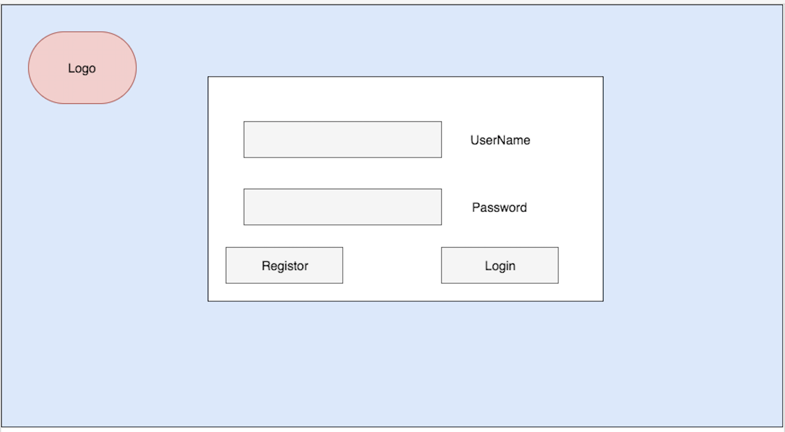
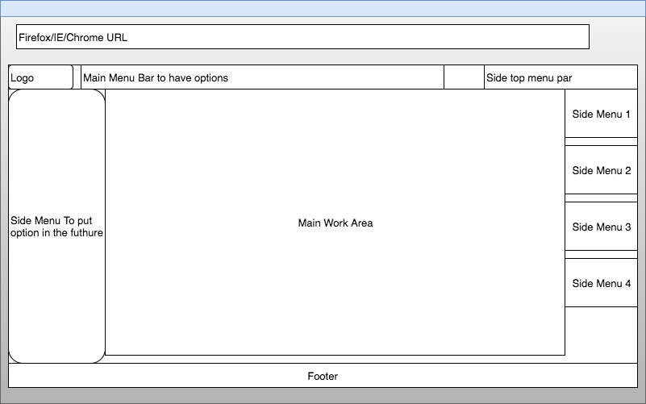
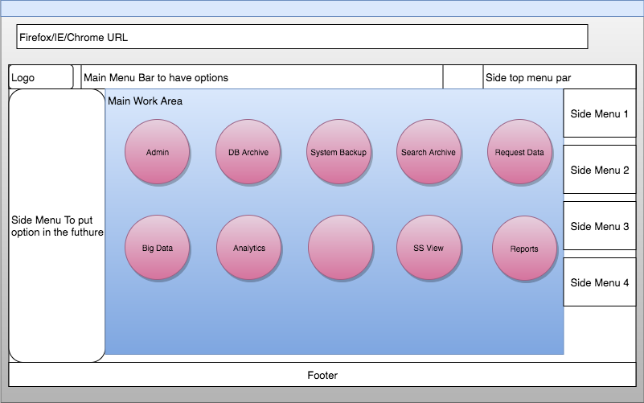
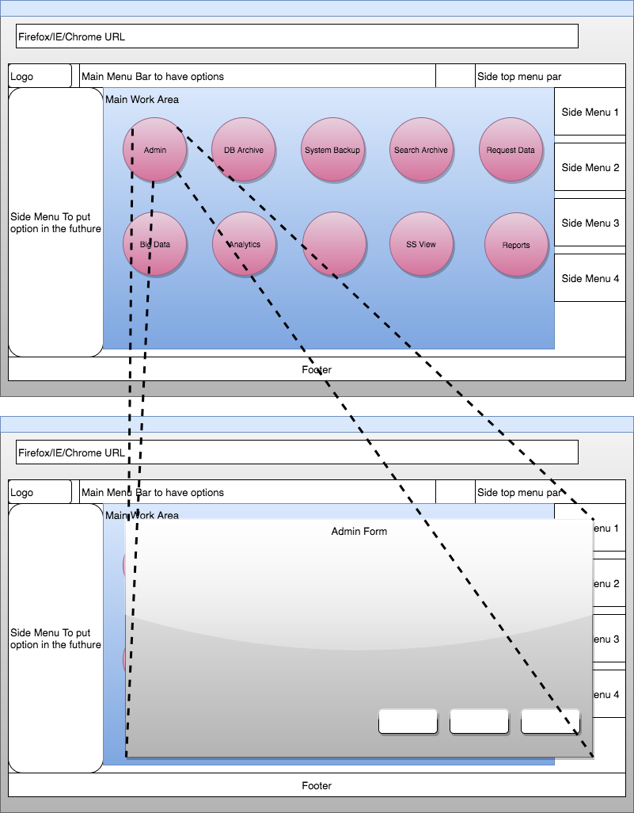
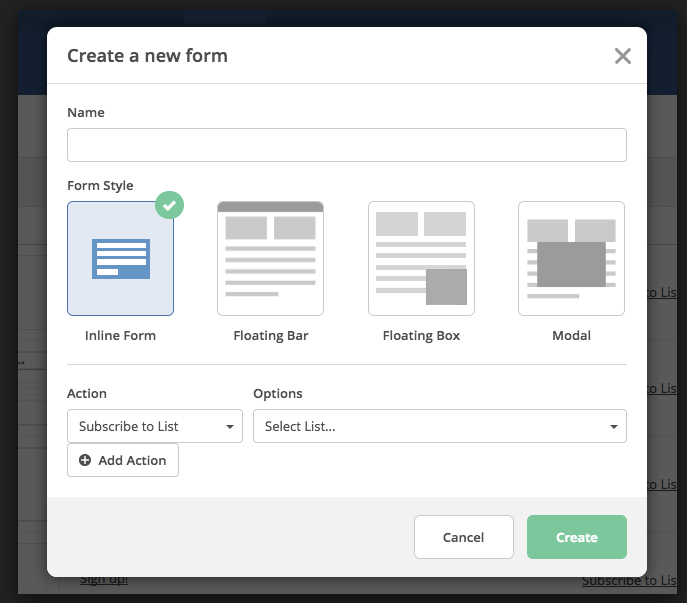
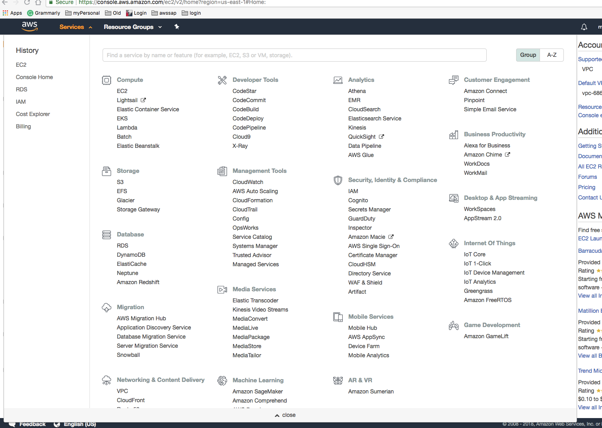

# AWS Arora Project

### Phase 1:
This Web Application should be
  1. Serverless on AWS.
  2. Can dynamically be changed to add more pages to the form.
  3. Have a look and feel of a professional web application that can start services in the backend using API calls.
  4. We will need this application to be a container that we can add more pages and features.
  5. This system can use DynamoDB in the backend.
  6. Have the floating form feel to the open browser.
  7. Should have a Federated authentication to manage users.


Tech to Use:
  1. html
  2. Node js or javascript (Client Side)
  3. html and associated file but separate .js under scr
  4. CSS


```
root
  \scr
      index.js
      masterPage.js
  \style
      main.CSS
      other.CSS
      anythingelse.CSS
  \etc
  \instout
            s3file_out_dateandtimestamped.JSON
            s3file_out_dateandtimestamped.JSON
            rdsfile_out_dateandtimestamped.JSON
            rdsfile_out_dateandtimestamped.JSON
            etc...
  \instin
            s3file_in_dateandtimestamped.JSON
            s3file_in_dateandtimestamped.JSON
            rdsfile_in_dateandtimestamped.JSON
            rdsfile_in_dateandtimestamped.JSON
            etc...

  \index.html
  \masterPage.html
  \etc...
```


1. Login page that will connect to an authentication provider(Single Sign On):
    a. Create a login screen that lets users log in or signup using AWS SSO authentication provided.
    b. Login should timeout. The timeout setting should be adjustable utilizing an admin setting page.
    c. Should have a placeholder for logs and text.
    d. Able to disable authentication during testing/development



2. A way to create icons on the landing page;
    a. When users click the icones; this will open forms.
    b. The icones will be circuler or iPhone/Android-like icons.
    c. An settings page with form that will let me add icons to the landing page and
      1. link it to a form/Page.
      2. select a image of the icone.
      3. Setting to either open a form or take user to another html page.
      4. Some backgroud color and format.






3. A form that can write json to a new file in the root/ folder on the web page
  a. Create a javascript form that can be filled with
    1. text
    2. radio buttons
    3. drop-down list
    4. multiline text area.
    5. submit button.
  b. When save button is pressed data from the form is saved to a folder in the root "instout" in a JSON format with key as the field name and values as the input.



